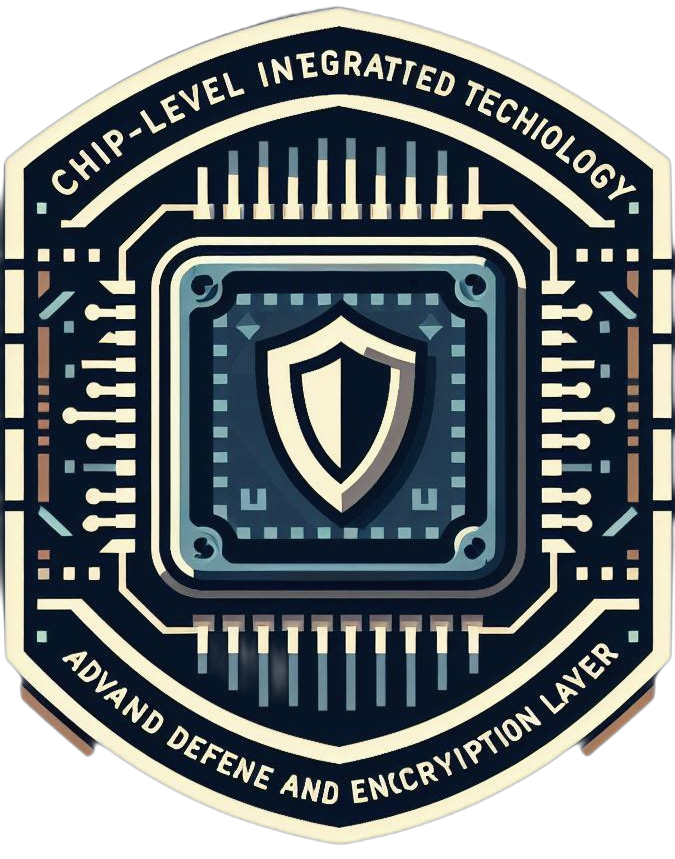

# Chip-Level Integrated Technology for Advanced Defense and Encryption Layer (CITADEL)

<p align="center">
  
</p>

This project implements a hardware-based Advanced Encryption Standard (AES) algorithm, optimized for high-speed, secure chip-to-chip communication. The AES-256 encryption standard is used to ensure robust security, with the project leveraging the **BaseJump STL** framework for integration and testing. 

The goal of this project is to design a cryptographic module that guarantees secure data transmission between chips, focusing on performance and efficiency, while maintaining transparency through the use of open-source tools.

## Key Features
- **AES-256 Implementation**: A hardware implementation of the AES-256 standard, which operates on 128-bit data blocks and uses a 256-bit key.
- **Integration with BaseJump STL**: Uses BaseJump STL for off-chip communication, allowing secure data transfer between chips.
- **Open-Source Design**: Built using the SkyWater 130nm open-source process, ensuring transparency and accessibility.
- **High-Performance Design**: Optimized for high throughput and low power consumption, meeting the performance demands of secure inter-chip communication.
- **Extensive Testing**: Includes automated testbenches with over 50,000 randomized trials, ensuring the correctness and robustness of the encryption and decryption modules.

## System Architecture
The system consists of three main modules:
1. **Encryption Module**: Implements the AES-256 encryption algorithm to encrypt data before transmission.
2. **Decryption Module**: Decrypts incoming encrypted data, restoring it to its original form.
3. **bsg_link Integration**: AES modules are tightly integrated with the BaseJump STL’s `bsg_link` modules to provide secure communication.

## Performance Metrics
The project has been thoroughly evaluated with respect to performance, power, and area (PPA) metrics:
- **Maximum Frequency**: 95.5 MHz
- **Power Consumption**: 165.83 mW
- **Area**: 1,966,416 µm²

## Experimental Setup
The design is implemented using the **SkyWater 130** process and verified with **Synopsys VCS** simulation and **Cadence Tempus** for static timing analysis. Testing includes NIST vector files for validation, ensuring compliance with established cryptographic standards.

## Testing & Validation
- Automated simulation using **CocoTB** with randomized inputs to verify the correctness of encryption and decryption.
- **DRC** and **LVS** verification to ensure the physical design adheres to specifications.
- Extensive functional testing using trace replay and BaseJump STL’s infrastructure to validate the encryption performance in a real-world scenario.

## Future Work
The project identifies several areas for improvement, including:
- Optimization of the S-Box memory overhead.
- Reduction of transmission bit width to improve throughput.
- Enhancements to resist side-channel attacks.
- Full-scale ASIC tapeout and further real-world validation.

## How to Run
1. Clone the repository:
   ```bash
   git clone https://github.com/eyhc1/bsg_aes.git
   ```
2. Follow the instructions in the `bsg_aes` directory to set up the simulation environment using BaseJump STL and SkyWater PDK.

## Acknowledgements
This project build on top of BaseJump's [BSG-Chip](https://github.com/bsg-external/ee478-designs-project.git), which is subjected to a license. See license file for specifics of licenses

## References
1. [Advanced Encryption Standard (AES)](https://dx.doi.org/10.6028/nist.fips.197-upd1)
2. [BaseJump STL](https://github.com/bespoke-silicon-group/basejump_stl)
3. [SkyWater PDK](https://github.com/google/skywater-pdk)

